#Guia de Uso

Abaixo serão apresentados um guia para ajudá-lo com a utilização do BOT.

##O BOT

Ao acessar o BOT pela primeira vez será apresentado uma tela com informações sobre o BOT.

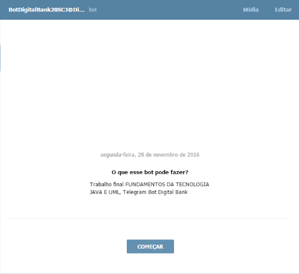

##/start

Clique em começar para iniciar a execução do BOT. O comando **/start** será executado. Uma tela de boas vindas será apresentada.

Nessa tela podemos executar duas ações, **/criarconta** ou usar a opção **/ajuda**.

##/ajuda

Um menu com todas opções disponíveis será exibido.

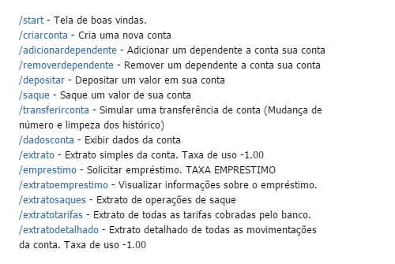

##/criarconta

Em criar conta começamos a utilização do BOT. Essa opção criará uma nova conta no banco virtual. Esse comando funciona em dois passos, no primeiro passo será solicitado a digitação do nome completo.

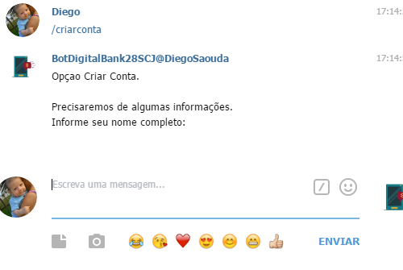

No segundo passo será solicitado o valor inicial de abertura da conta.

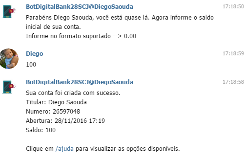

Após a digitação dessas informações uma tela de sucesso será exibida. Essa tela informa que a conta foi criada com sucesso, e exibe dados básicos da conta, tais como o nome do cliente, número da conta e o saldo.

#O que fazer após a criação da conta

Logo após a criação da conta o cliente está livre para realizar qualquer ação no banco virtual. Abaixo damos dicas para os próximos passos.

##/adicionardependente

Nessa opção será informado o nome do dependente, basta informá-lo para vincular outro usuário a sua conta.

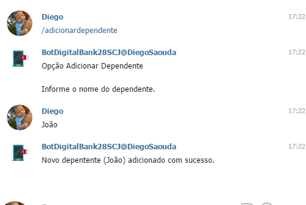

##/removerdependente

Se desejar remover um dependente basta informar o nome desse dependente.

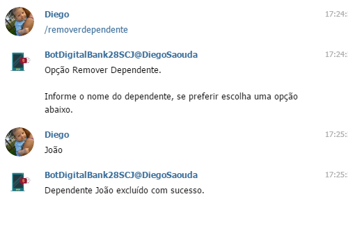

Se preferir clique no botão que será apresentado trazendo o nome do(s) dependente(s).

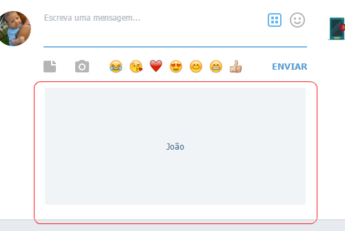

##/saque

Ao solicitar a opção saque alguns botões com valores personalizados serão exibidos.

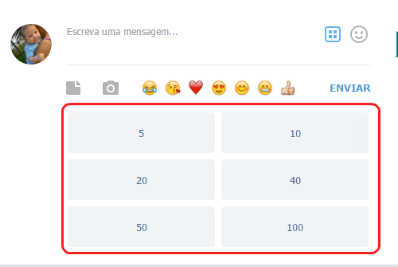

Se preferir, informe o valor desejado no campo texto. O valor deve ser inteiro ou um double.

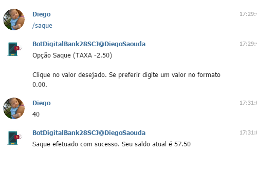

Após realização do saque uma mensagem de sucesso será exibida com o saldo atual de sua conta.

##/depositar

A opção depositar é muito parecida com a opção saque. Alguns botões com valores personalizados serão exibidos.

Se preferir você pode informar o valor a ser depositado no campo texto.

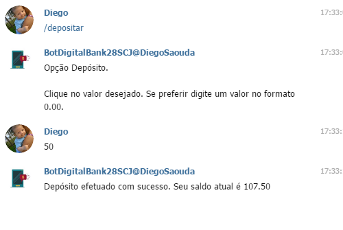

Ao finalizar a operação uma tela de sucesso será exibida com o saldo atual de sua conta.

##/dadosconta

Essa opção irá retornar seus dados pessoais, dados resumidos de sua conta, saldo e dependentes. 

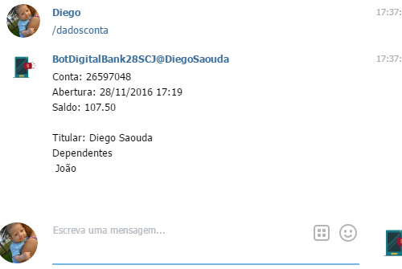

##Extratos - /extratodetalhado

O sistema possui diversos extratos:

 - /extrato
 - /extratosaques
 - /extratotarifas
 - /extratodetalhado
 - /extratoemprestimo

Obs: Na opção **/ajuda** você tem mais detalhes sobre cada extrato.
 
O funcionamento das opções extratos são parecidas, apenas o contexto da informação é diferente. Por exemplo, no extrato de saques, apenas informações sobre saque é apresentada. A fim de simplificar o uso desse guia vamos apresentar o extrato detalhado.

Abaixo um exemplo da saída do comando **/extratodetalhado**.

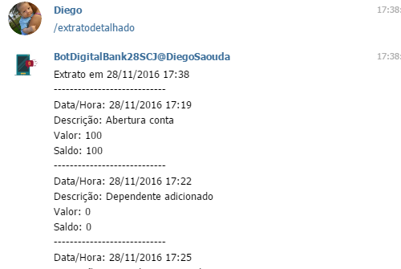

No final do extratodetalhado é apresentado uma somatória das movimentações.

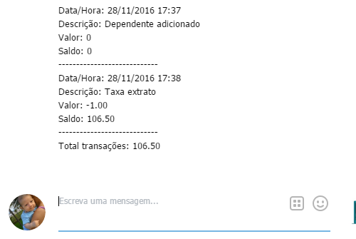

##/transferirconta (Simula um processo de trag)

Após a digitação desse comando será perguntado se deseja continuar ou não com o processo de transferência.

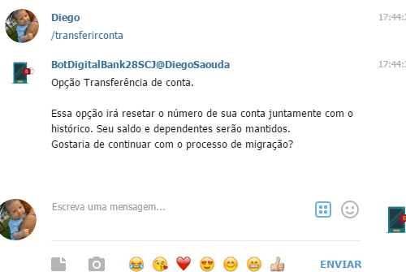

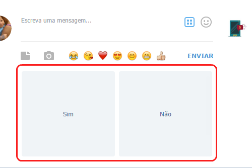

Se for informado que sim a transferência será executada.

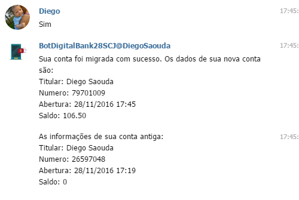

No último passo do processo de transferência é exibido o número da conta nova e informações da conta antiga. Observe que a conta antiga está zerada.

##/emprestimo

Ao solicitar a opção emprestimo será solicitado o tempo de pagamento.

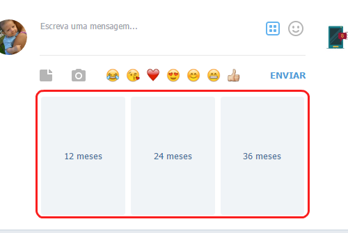

Caso os prazos personalizados não atendam a sua necessidade o sistema possui uma inteligência de linguagem natural com algumas opções:

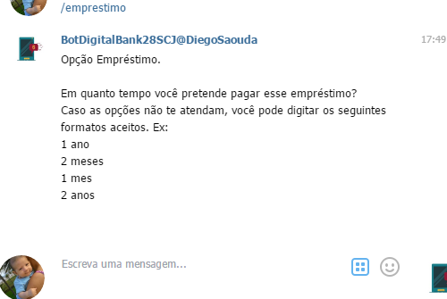

A expressão aceita um **número** seguida da palavra **ano, anos, meses ou mês**. No exemplo selecionamos 24 meses.

Em seguida será solicitado o valor do empréstimo. 

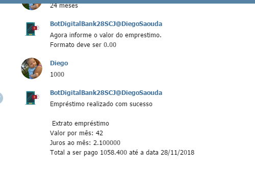

Ao final da operação de empréstimo o sistema apresentará informações resumidas do empréstimo que acabou de realizar, data final do pagamento, juros ao mês e o novo saldo de sua conta.

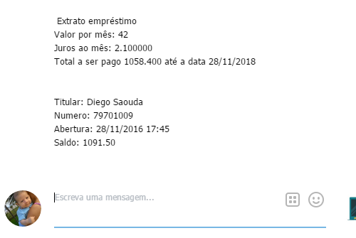

##Observações

Apenas o comando **/criarconta** deve ser executado primeiro. Após criação da conta você está livre para digitar os comandos em qualquer ordem.